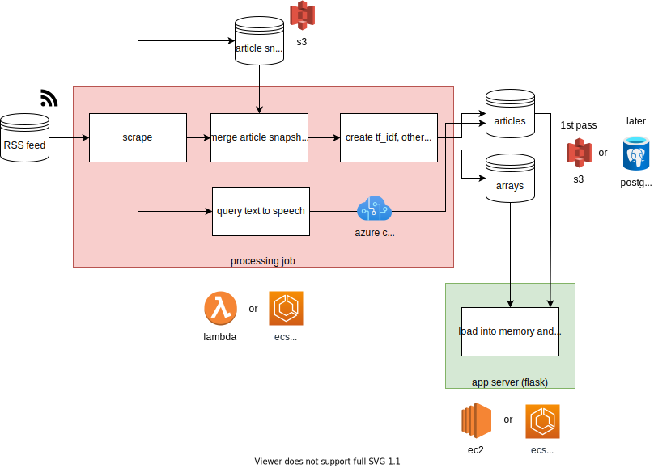

# 🎧 Audiozprávy

Oficiální repozitář týmu Audiozpráv v projeku #run-inovace-zpravodajskeho-storytellingu na Česko.digital

## 🔎 Co je obsahem repozitáře?

**/app** - mobilní aplikace Audiozpráv

**/backend** - API / BE aplikace (rekomendační systém)

**/infrastructure** - Terraform definice cloudové infrastruktury

**/pipeline** - pipeline zpracování nových zpráv (RSS scrape, preprocessing, TTS)

## 🛠 Jak přispívat?

**Jazyky:**

- Angličtina: Kód, komentáře, pull-requesty, commit zprávy
- Čeština: README a Issues

**Issues:**

- Název by měl obsahovat zda se jedná o vývoj na aplikaci, nebo backendu + výstižný popisek (např. APP: Home screen komponenta)
- Issue by měl obsahovat snadno pochopitelné zadání, z kterého bude zřejmé co je výstupem
- Pokud se jedná o issue na FE měl by obsahovat screenshot z Figmy + odkaz na Figmu
- Jednodušší issues tagujeme "good first issue", abychom mohli lépe vybírat úkoly pro juniornější vývojáře
- Jakmile se někdo issue ujme, je potřeba ho k němu přiřadit

**Pull-requesty:**

- Vytváříme fork-branches s názvem {iniciály-developera}-{číslo-issue}-{krátký-popisek}, tedy např. `jn-74-test-branch`
- Před vytvořením pull-requestu interactive rebase s jedním commitem, ostatní jako fixup (název commitu = název branche)
- Název pull requestu = název branch
- Každé issue by mělo projít code-review od tech-lead + v případě práce na FE i schválení ze projektové strany týmu / grafika

## 🚀 Setup mobilní aplikace

`cd app` - přesun do adresáře aplikace

`yarn install` - nainstalování dependencies

`yarn start` - spuštění dev prostředí

## 🏛 Struktura BE aplikace



## 🚀 Setup backendu

`cd pipeline`

`pip install -r requirements.txt`

`curl --remote-name-all https://lindat.mff.cuni.cz/repository/xmlui/bitstream/handle/11234/1-1836{/czech-morfflex-pdt-161115.zip}` - stažení Morphodity

`unzip czech-morfflex-pdt-161115.zip` - unzip souborů

`rm czech-morfflex-pdt-161115.zip` - odstranění původního souboru

`python main.py` - spuštění celého procesu

`cd ../backend` - přesun do adresáře s backendem

`pip install -r requirements.txt` - nainstalování dependencies

`python app.py` - spuštění Flask serveru

`black pipeline` - formátování

`isort pipeline --profile black` - formátování

### Spuštění v Dockeru lokálně

Pipeline:

```
cd pipeline
docker build -t az-pipeline .
docker run -ti --env LOCAL_DEV=1 -v /path/to/your/local/s3:/app/s3 az-pipeline
```

Backend:

```
cd backend
docker build -t az-backend .
docker run -ti --env LOCAL_DEV=1 -p 5000:5000 az-backend
```

### Lokální vývoj

Stačí zadát env variable a spustit dva hlavní skripty takto:
```
LOCAL_DEV=1 pipeline/main.py
LOCAL_DEV=1 backend/app.py
```

## ☎️ Komu se mám ozvat?

**Techlead:** Jiří Zikeš (jiri@xomlo.io, 725 523 929)
